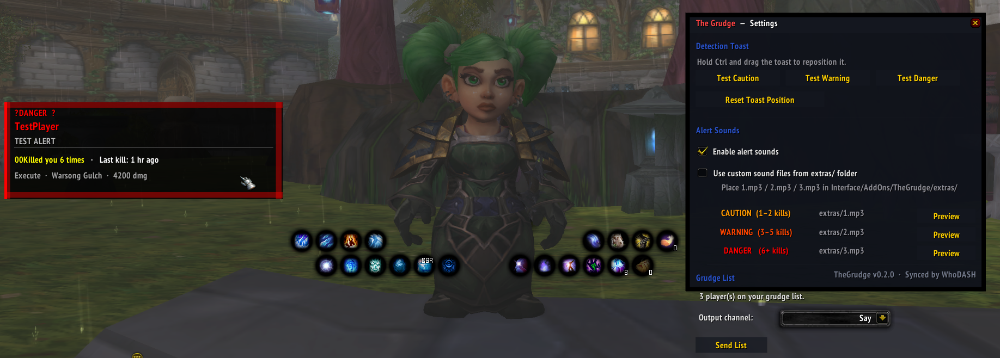

# The Grudge

**Belmont Labs — Experiment 07**

A persistent grudge-tracking addon for World of Warcraft 3.3.5a (WotLK private servers, primarily Warmane).

Maintains a list of players who have killed you and fires real-time proximity alerts the moment one of them enters your vicinity — via seven independent detection layers running in parallel.
<p align="center">
  
</p>
---

## Features

### Seven Detection Layers
1. **Combat Log** — catches grudge targets in any nearby combat event (~60 yd range)
2. **Nameplate Sweep** — polls visible nameplates every 3 seconds
3. **Group Roster** — instantly flags a grudge target if they join your party or raid
4. **Target Frame** — fires the moment you click or tab-target someone on the list
5. **Mouseover** — detects grudge targets as you hover over unit frames or nameplates
6. **Chat Scanner** — monitors SAY, YELL, General, Trade, Whisper, and Emote channels
7. **`/who` Sweep** — periodically queries the realm to check if any target is online, plus a burst sweep on every zone transition

### Alert System
- **Severity tiers** based on kill count:
  - 🟠 **CAUTION** — 1–2 kills
  - 🔴 **WARNING** — 3–5 kills
  - 💀 **DANGER** — 6+ kills
- **Visual popup** — draggable, animated toast with fade-in/pulse/fade-out lifecycle
  - Hold `Ctrl` to drag and reposition
  - Auto-dismisses after 5 seconds; pins while your cursor is over the target
- **Chat output** — kill count, last seen time, and most recent incident details
- **Sound alerts** — severity-mapped; supports custom MP3 overrides in `extras/`

### Private Server Compatibility
- `ServerTranslator` auto-detects Warmane, Dalaran, ChromieCraft, TurtleWoW, and Firestorm
- Normalises combat log varargs that differ across 3.3.5a builds (missing `hideCaster`, string flags, shifted field order)
- `/who` output suppression via `ChatFrame_AddMessageEventFilter` to keep chat clean

---

## Installation

1. Copy the `TheGrudge/` folder into `World of Warcraft/Interface/AddOns/`
2. Log in and `/reload`
3. TheGrudge reads its grudge list from `TheGrudgeDB.lua` — see **Data Source** below

---

## Data Source

TheGrudge does **not** manage its own grudge list. Player data is written to `TheGrudgeDB.lua` by **WhoDASH / SyncDAT** and loaded as a read-only Lua file by WoW at startup.

```
Interface/AddOns/TheGrudge/TheGrudgeDB.lua   ← written by SyncDAT, read by addon
WTF/Account/.../SavedVariables/              ← TheGrudgeSettings only (popup position, sound prefs)
```

After SyncDAT pushes a new `TheGrudgeDB.lua`, type `/reload` in-game to pick up the changes.

---

## Commands

| Command | Description |
|---|---|
| `/grudge` or `/tg` | Show help |
| `/grudge list` | Print all grudge targets |
| `/grudge status` | Show enabled/disabled state |
| `/grudge on / off` | Toggle detection |
| `/grudge reload` | Rebuild grudge map from DB |
| `/grudge ui` | Open settings window |
| `/grudge who` | Manually trigger a `/who` sweep |
| `/grudge server` | Show detected server |
| `/grudge server <name>` | Override server (Warmane, Dalaran…) |
| `/grudge debug [name]` | Diagnostic dump |
| `/grudge test <name>` | Simulate an alert for a grudge target |

---

## Settings

Open with `/grudge ui` or `/grudge settings`.

- **Test toast** at each severity level (Caution / Warning / Danger)
- **Reset toast position** to default
- **Enable/disable alert sounds**
- **Custom sound files** — drop `1.mp3`, `2.mp3`, `3.mp3` into `extras/` to override per-tier
- **Send list** to a chat channel (Say, Yell, Party, Raid, Guild, Local Defense)

---

## Custom Sounds

| File | Tier | Default fallback |
|---|---|---|
| `extras/1.mp3` | CAUTION (1–2 kills) | Whisper notification |
| `extras/2.mp3` | WARNING (3–5 kills) | Creature aggro grunt |
| `extras/3.mp3` | DANGER (6+ kills) | "You are being attacked" |

Silent placeholder files are shipped so `PlaySoundFile` never errors. Replace any placeholder with your own audio to override that tier.

---

## Project Structure

```
TheGrudge/
├── TheGrudge.lua          # Namespace + version
├── TheGrudge.toc          # Addon manifest
├── Core.lua               # ADDON_LOADED, SavedVariables bootstrap, slash commands
├── Detection.lua          # All seven detection layers
├── Alert.lua              # Visual popup, sound, chat output
├── ServerTranslator.lua   # Combat log normaliser + server auto-detection
├── SettingsUI.lua         # /grudge ui settings window
├── TheGrudgeDB.lua        # Grudge list data — written by WhoDASH/SyncDAT
└── extras/
    ├── 1.mp3              # CAUTION sound slot (silent placeholder)
    ├── 2.mp3              # WARNING sound slot (silent placeholder)
    ├── 3.mp3              # DANGER sound slot (silent placeholder)
    └── README.txt         # Sound slot mapping reference
```

---

## Ecosystem

TheGrudge is part of the **Belmont Labs** addon suite:

- **WhoDASH** — player intelligence and `/who` automation
- **SyncDAT** — bidirectional SavedVariables sync bridge (pushes grudge lists to TheGrudge)
- **TheGrudge** — proximity alerting against your grudge list *(this addon)*

---

## Compatibility

- **Client**: WoW 3.3.5a (WotLK)
- **Tested on**: Warmane (Icecrown / Lordaeron)
- **Server detection**: Warmane, Dalaran, ChromieCraft, TurtleWoW, Firestorm

---

## Version

`v0.2.0` — Belmont Labs
